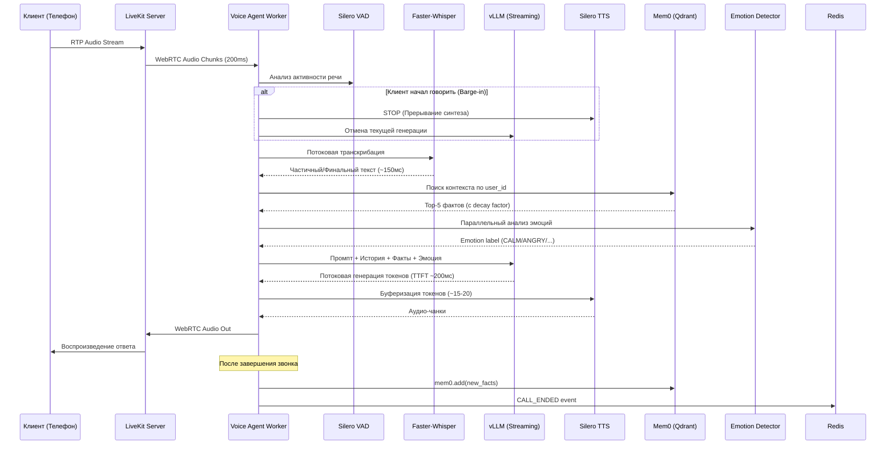
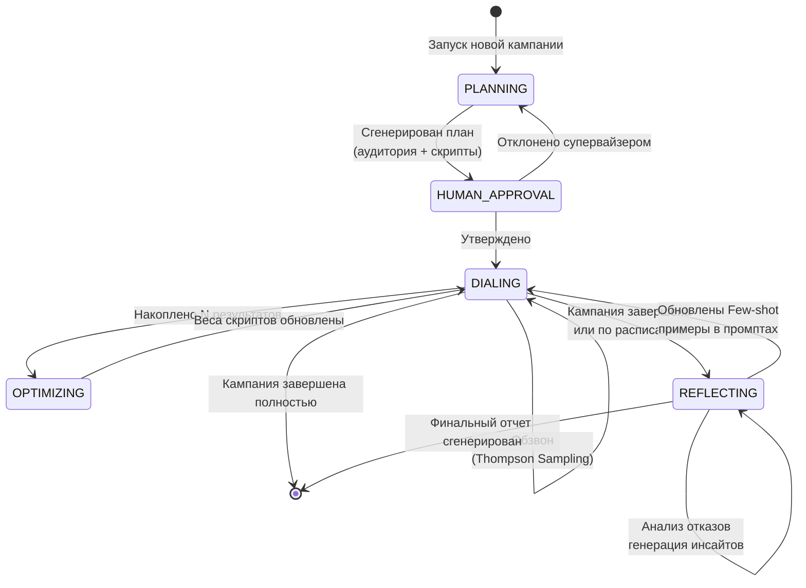
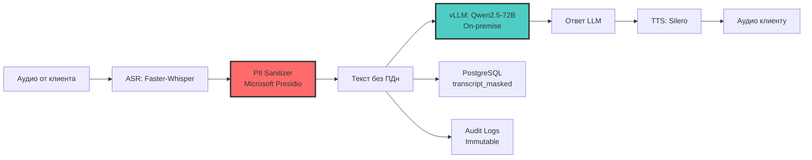

# 🎙️ VoiceGraph: Autonomous Predictive Outbound Agent

[](https://www.python.org/)
[](https://www.rust-lang.org/)
[](https://langchain-ai.github.io/langgraph/)
[](https://docs.livekit.io/)
[](https://github.com/vllm-project/vllm)
[](https://catboost.ai/)
[](https://github.com/mem0ai/mem0)
[](https://kubernetes.io/)

> **Полностью автономный AI-агент для исходящих кампаний**, заменяющий классические автообзвонщики. Объединяет предиктивную аналитику, мультиагентную оркестрацию, низколатентный голосовой конвейер (<800 мс) и эпизодическую память для гиперперсонализированных диалогов с механизмом самообучения.

---

## 📋 Содержание

- [Обзор проекта](#-обзор-проекта)
- [Ключевые возможности](#-ключевые-возможности)
- [Бизнес-метрики](#-бизнес-метрики-kpis)
- [Архитектура](#-архитектура)
- [Технологический стек](#-технологический-стек)
- [Документация проекта](#-документация-проекта)
- [Быстрый старт](#-быстрый-старт)
- [Roadmap реализации](#-roadmap-реализации)
- [Compliance и безопасность](#-compliance-и-безопасность)
- [Команда и роли](#-команда-и-роли)

---

## 🎯 Обзор проекта

**VoiceGraph** — это production-ready фреймворк для создания автономных AI-агентов исходящих кампаний (NPS, canvassing, collections). В отличие от классических predictive dialers, система:

### Описание конечной системы

Система представляет собой **полностью автономного цифрового сотрудника (AI Campaign Manager)**, закрывающего весь жизненный цикл исходящих коммуникаций: от формирования гипотезы и предиктивной сегментации базы до проведения полнодуплексного голосового диалога и генерации бизнес-инсайтов. В отличие от классических predictive dialers, система не использует статические скрипты. Она динамически генерирует сценарии под конкретного клиента, используя его эпизодическую память (Mem0), предсказывает оптимальное время контакта через ML-модель (CatBoost) и обучается на результатах каждого звонка через механизмы саморефлексии (Reflection) и многоруких бандитов (Thompson Sampling).

- 🧠 **Сама планирует кампании**: использует ML-скоринг (CatBoost) для предсказания оптимального времени и аудитории
- 🎭 **Генерирует скрипты на лету**: LLM создает 3-5 вариантов opening lines под каждого клиента
- 💬 **Ведет полнодуплексный диалог**: задержка <800 мс, поддержка barge-in (перебивания)
- 🧬 **Помнит клиента**: эпизодическая память (Mem0 + Qdrant) с механизмом "забывания" (decay factor)
- 🔄 **Самообучается**: Reflection Agent анализирует отказы и автоматически улучшает промпты
- 🎲 **Оптимизирует в реальном времени**: Thompson Sampling (Multi-Armed Bandit) выбирает лучший скрипт
- 🛡️ **Соответствует 152-ФЗ**: on-premise LLM, маскирование PII через Microsoft Presidio

### Бизнес-задача
Крупные контакт-центры и BPO сталкиваются с кризисом эффективности исходящих кампаний:
1. **Низкий Contact Rate:** До 70–75% звонков при «слепом» обзвоне не достигают цели.
2. **Жесткость скриптов:** Статические роботы не адаптируются под эмоциональное состояние или контекст клиента, что ведет к высокому Drop-off rate.
3. **Задержка инсайтов:** Аналитика по результатам кампаний собирается вручную и занимает дни или недели.
4. **Высокий CAC:** Стоимость привлечения или опроса одного клиента неоправданно высока из-за холостых затрат на телефонную связь и время операторов.

**Решение:** Внедрение автономного агента, который минимизирует холостые звонки за счет ML-прогнозирования и максимизирует конверсию за счет гиперперсонализированного GenAI-диалога в реальном времени.

---

## ✨ Ключевые возможности

### 🎙️ Real-time Voice Pipeline
- **End-to-end latency < 800 мс** (p95) благодаря streaming ASR → LLM → TTS
- **Barge-in < 300 мс** через Silero VAD + мгновенное прерывание TTS
- **Мультимодальный анализ эмоций** (OpenSMILE eGeMAPSv02) параллельно с ASR
- **Интеллектуальная буферизация TTS**: синтез по предложениям, а не по токенам

### 🧠 Интеллектуальная оркестрация
- **LangGraph State Machine**: 6 состояний (PLANNING → APPROVAL → DIALING → OPTIMIZING → REFLECTING → DONE)
- **Human-in-the-Loop**: супервайзер утверждает скрипты через Telegram-бот
- **Thompson Sampling**: динамическое перераспределение трафика между скриптами
- **Redis Checkpointing**: устойчивость к перезапускам подов Kubernetes

### 🧬 Эпизодическая память
- **Mem0 + Qdrant**: семантический поиск по истории взаимодействий
- **Memory Decay**: экспоненциальное снижение веса старых фактов
- **Auto-Recall**: извлечение top-5 фактов перед каждым звонком
- **Cross-session learning**: новые факты сохраняются после каждого диалога

### 🔄 Самообучение (Reflection)
- **Асинхронный анализ отказов**: LLM генерирует структурированные инсайты (Pydantic Structured Output)
- **Еженедельная агрегация**: кластеризация причин отказов
- **Автоматическое обновление промптов**: лучшие few-shot примеры внедряются в `planner_node`

### 🛡️ Compliance и безопасность
- **Microsoft Presidio**: маскирование паспортов, ИНН, СНИЛС, карт (Luhn algorithm)
- **On-premise vLLM**: данные не покидают контур РФ
- **Redis Circuit Breaker**: graceful degradation при сбоях CRM
- **Immutable Audit Logs**: неизменяемые логи действий агента

---

## 📊 Бизнес-метрики (KPIs)

| Метрика | Базовый уровень | Целевое значение |
|---------|-----------------|------------------|
| **Contact Rate** (доля дозвона) | 25% | **> 40%** |
| **Completion Rate** (дослушавшие до конца) | 40% | **> 65%** |
| **Target Action Rate** (NPS/продажа) | 1x | **2.5x** |
| **Cost per Contact** | 100% | **-35-45%** |
| **Time-to-Insight** | 5-7 дней | **< 2 часов** |
| **Technical Latency** (p95) | > 2000 мс | **< 800 мс** |
| **ML ROC-AUC** (propensity model) | 0.65 | **> 0.85** |

---

## 🏗️ Архитектура

### Высокоуровневая архитектура

```mermaid
graph TD
    subgraph "Уровень 1: Внешние интерфейсы"
        SIP[SIP-телефония / PSTN]
        Client[Клиент (Голос)]
        CRM[CRM: Битрикс24 / amoCRM]
        Supervisor[Супервайзер (Telegram)]
    end

    subgraph "Уровень 2: Шлюз и Оркестрация"
        APIGW[API Gateway / Ingress]
        SIPBridge[SIP ↔ WebRTC Bridge<br/>Active Call / Rust]
        LangGraph[LangGraph Orchestrator<br/>Campaign Manager]
    end

    subgraph "Уровень 3: Ядро ИИ и Голоса"
        LiveKit[LiveKit Server<br/>WebRTC Media]
        VoiceWorker[LiveKit Voice Agent Worker]
        vLLM[vLLM Cluster<br/>Qwen2.5-72B / YandexGPT]
        ASR[Streaming ASR<br/>Faster-Whisper]
        TTS[Streaming TTS<br/>Silero]
        Emotion[Emotion Detector<br/>OpenSMILE]
    end

    subgraph "Уровень 4: ML, Память и Интеграции"
        CatBoost[Propensity Model<br/>FastAPI + CatBoost]
        Mem0[Episodic Memory<br/>Mem0 + Qdrant]
        Composio[Composio Integration Hub]
        Reflection[Reflection Agent<br/>Async]
    end

    subgraph "Уровень 5: Данные и Инфраструктура"
        PG[(PostgreSQL 16<br/>+ pgvector)]
        Redis[(Redis 7.2<br/>Streams + Cache)]
        MinIO[(MinIO S3<br/>Аудио / Логи)]
        MLflow[(MLflow<br/>MLOps)]
        OTel[OpenTelemetry Collector]
    end

    Client <-->|SIP/RTP| SIP
    SIP <--> SIPBridge
    SIPBridge <-->|WebRTC| LiveKit
    LiveKit <--> VoiceWorker
    
    VoiceWorker <-->|Audio Chunks| ASR
    VoiceWorker <-->|Text Stream| vLLM
    VoiceWorker <-->|Audio Stream| TTS
    VoiceWorker -.->|Parallel Audio| Emotion
    
    LangGraph <--> VoiceWorker
    LangGraph <--> CatBoost
    LangGraph <--> Mem0
    LangGraph <--> Reflection
    
    LangGraph <--> Composio
    Composio <--> CRM
    LangGraph <--> Supervisor
    
    VoiceWorker -->|Masked Logs| PG
    VoiceWorker -->|Raw Audio| MinIO
    LangGraph -->|State Checkpoints| Redis
    
    ASR -.->|Metrics| OTel
    vLLM -.->|Metrics| OTel
    OTel --> Grafana[(Grafana Dashboards)]
```

### Сквозной поток данных (Sequence Diagram)



### Жизненный цикл кампании (State Machine)



---

## 🛠️ Технологический стек

### Ядро системы

| Компонент | Технология | Обоснование |
|-----------|-----------|-------------|
| **Orchestration** | LangGraph + Redis | Нативная поддержка циклов, прерываний (HITL), персистентности |
| **Voice Pipeline** | LiveKit Agents + Silero VAD | Low-latency WebRTC, barge-in, async Python |
| **LLM Inference** | vLLM + Qwen2.5-72B | Max throughput, prefix caching, 152-ФЗ (on-premise) |
| **ASR / TTS** | Faster-Whisper / Silero | Оптимизированы для CPU/GPU, отличное качество для русского |
| **Propensity ML** | CatBoost + FastAPI | State-of-the-art для табличных данных, <10мс инференс |
| **Memory** | Mem0 + Qdrant | Эпизодическая память с decay и реляционными связями |
| **Integrations** | Composio | 150+ готовых коннекторов к CRM |
| **Security** | Microsoft Presidio | On-premise PII masking с кастомными regex (СНИЛС, ИНН) |
| **Observability** | OpenTelemetry + Prometheus | Сквозной трейсинг от SIP до записи в БД |

### Инфраструктура

| Компонент | Технология | Версия |
|-----------|-----------|--------|
| **Язык** | Python | 3.12 |
| **Мост WebRTC↔SIP** | Rust + Active Call | 1.75+ |
| **SIP PBX** | Asterisk | 20-certified |
| **БД** | PostgreSQL | 16 + pgvector |
| **Кэш/Очереди** | Redis | 7.2 (AOF) |
| **Vector DB** | Qdrant | 1.9+ |
| **Object Storage** | MinIO | latest |
| **Orchestration** | Kubernetes | 1.28+ |
| **MLOps** | MLflow | 2.18+ |
| **Data Versioning** | DVC | 3.50+ |
| **CI/CD** | GitLab CI / GitHub Actions | - |

---

## 📚 Документация проекта

Полная документация находится в директории [`/docs`](./docs/). Структура:

### 🎯 Стратегические документы

| Документ | Описание |
|----------|----------|
| [**specification.md**](./docs/specification.md) | Техническое задание: бизнес-цели, KPI, функциональные и нефункциональные требования |
| [**requirements.md**](./docs/requirements.md) | Детальные требования к системе (FR, NFR, Compliance, MLOps) |
| [**architecture.md**](./docs/architecture.md) | Высокоуровневая архитектура, Mermaid-диаграммы, технологический стек |
| [**phases.md**](./docs/phases.md) | Общий план из 7 этапов (0-6) с критериями перехода |
| [**adr.md**](./docs/adr.md) | Architecture Decision Records — 10 ключевых архитектурных решений |
| [**review.md**](./docs/review.md) | Анализ рисков, скрытых угроз и стратегии митигации |

### 🏗️ Архитектурные артефакты

| Документ | Описание |
|----------|----------|
| [**data_api_contracts.md**](./docs/data_api_contracts.md) | DDL PostgreSQL, OpenAPI спецификации, Pydantic-модели (State, Tools) |
| [**ai_ml_specifications.md**](./docs/ai_ml_specifications.md) | Prompt Library, Feature Dictionary для CatBoost, Golden Dataset |
| [**testing_strategy.md**](./docs/testing_strategy.md) | План нагрузочного тестирования (Locust, SIPp), Security Checklist |
| [**iac_cicd_observability.md**](./docs/iac_cicd_observability.md) | Docker Compose, Kubernetes манифесты, Prometheus/Grafana, CI/CD |
| [**epics_user_stories.md**](./docs/epics_user_stories.md) | Декомпозиция на эпики и user stories с Acceptance Criteria |

### 🏗️ Структуру проекта

| Документ | Описание |
|----------|----------|
| [**structure.md**](./docs/structure.md) | Полная структура проекта: дерево файлов, описание каждого модуля |

### 🚀 Детальный план реализации (Phases)

#### 🟢 **ЭТАП 0: Подготовительный и Compliance**

| Документ | Описание |
| :--- | :--- |
| 📄 **[phase_0_step_1.md](./docs/phase_0_step_1.md)** | **Аудит и нормализация данных CRM.** ETL-пайплайн валидации исторических данных за 12 месяцев. Строгая типизация через Pydantic, фильтрация по 38‑ФЗ. Версионирование через DVC, проверка качества через Great Expectations. |
| 📄 **[phase_0_step_2.md](./docs/phase_0_step_2.md)** | **Инфраструктура телефонии и WebRTC‑мост.** Микросервис‑шлюз на Rust (Active Call) для трансляции WebRTC‑потока от LiveKit в SIP‑транк Asterisk. SIPREC для дуплексной записи, Answering Machine Detection (AMD). |
| 📄 **[phase_0_step_3.md](./docs/phase_0_step_3.md)** | **PII‑маскирование.** Асинхронный сервис `PIISanitizer` на базе Microsoft Presidio (on‑premise). Кастомные распознаватели для РФ (паспорта, ИНН, СНИЛС, карты). Защита от утечек в LLM и логи (152‑ФЗ). |

---

#### 🔵 **ЭТАП 1: Real‑time Voice Pipeline**

| Документ | Описание |
| :--- | :--- |
| 🚀 **[phase_1_step_1.md](./docs/phase_1_step_1.md)** | **Развертывание и оптимизация vLLM.** Инференс Qwen2.5‑72B на кластере 4×H100. `tensor_parallel_size=4`, `enable_prefix_caching=true`. Бенчмаркинг latency. |
| 🎙️ **[phase_1_step_2.md](./docs/phase_1_step_2.md)** | **Сборка LiveKit Voice Agent.** Асинхронный воркер: Silero VAD (barge‑in <300 мс) → Streaming ASR (Faster‑Whisper) → Streaming LLM → TTS (Silero). |
| 🧠 **[phase_1_step_3.md](./docs/phase_1_step_3.md)** | **Мультимодальный анализ эмоций.** OpenSMILE (eGeMAPSv02) параллельно с ASR. Классификация эмоций (CALM, ANGRY), адаптация промпта LLM. |

---

#### 🟣 **ЭТАП 2: Propensity Modeling & MLOps**

| Документ | Описание |
| :--- | :--- |
| 📊 **[phase_2_step_1.md](./docs/phase_2_step_1.md)** | **Feature Engineering и обучение CatBoost.** 50+ признаков (исторические, поведенческие, контекстные). Два таргета (`p_answer`, `p_conversion`). MLflow для логирования экспериментов. |
| ⚙️ **[phase_2_step_2.md](./docs/phase_2_step_2.md)** | **Калибровка и FastAPI‑сервис инференса.** Platt Scaling. Docker‑образ. Эндпоинт `/predict` с In‑Memory кэшем, latency **< 10 мс** на батч 1000 юзеров. |

---

#### 🟠 **ЭТАП 3: LangGraph Оркестрация и Бандиты**

| Документ | Описание |
| :--- | :--- |
| 🧩 **[phase_3_step_1.md](./docs/phase_3_step_1.md)** | **Управление состоянием кампании.** Строго типизированная модель `CampaignState`. Кастомный `AsyncRedisSaver` (CheckpointSaver) с сериализацией через `msgspec`. |
| 🔀 **[phase_3_step_2.md](./docs/phase_3_step_2.md)** | **Проектирование узлов графа.** Узлы: `planner` (скрипты), `human_approval` (interrupt + Telegram‑бот), `dialer` (Redis Streams), `optimizing`, `reflecting`. |
| 🎲 **[phase_3_step_3.md](./docs/phase_3_step_3.md)** | **Реализация Thompson Sampling.** Bandit Optimizer на базе `scipy.stats.beta`. Динамическое перераспределение трафика (Exploration vs Exploitation). |

---

#### 🧬 **ЭТАП 4: Интеграция эпизодической памяти**

| Документ | Описание |
| :--- | :--- |
| 🧠 **[phase_4_step_1.md](./docs/phase_4_step_1.md)** | **Настройка Mem0 и Qdrant.** Qdrant on‑premise. Клиент Mem0 с локальным LLM (Qwen‑7B) для извлечения фактов. Payload‑индексы с `decay_factor`. |
| 🔄 **[phase_4_step_2.md](./docs/phase_4_step_2.md)** | **Auto‑Recall и инъекция в контекст.** Извлечение top‑5 фактов перед звонком (Memory Decay). Блок `<MEMORY_CONTEXT>` в системный промпт. Сохранение новых фактов. |

---

#### 🔄 **ЭТАП 5: Reflection Agent и самообучение**

| Документ | Описание |
| :--- | :--- |
| 📝 **[phase_5_step_1.md](./docs/phase_5_step_1.md)** | **Сбор мета‑данных и триггер рефлексии.** Асинхронная запись логов в PostgreSQL. Очередь `reflection_queue` (Redis Streams) для звонков со статусом `REFUSAL` или `ANGRY`. |
| 🤖 **[phase_5_step_2.md](./docs/phase_5_step_2.md)** | **LLM‑анализ и кластеризация инсайтов.** Структурированные инсайты через Pydantic. Еженедельный Cron‑джоб: кластеризация причин отказов, обновление Few‑Shot примеров в промптах. |

---

#### 🚀 **ЭТАП 6: Интеграции, Observability и сдача**

| Документ | Описание |
| :--- | :--- |
| 🔗 **[phase_6_step_1.md](./docs/phase_6_step_1.md)** | **Интеграция через Composio (CRM).** OAuth для Битрикс24/amoCRM. Инструменты LangGraph (`create_deal`, `add_task`). Redis Circuit Breaker и Retry Queue. |
| 📊 **[phase_6_step_2.md](./docs/phase_6_step_2.md)** | **Observability и дашборды.** OpenTelemetry для инструментации. Метрики (`voice_latency_ms`, `asr_wer`, `bandit_weights`) в Prometheus. Grafana дашборды, Telegram‑алерты. |
| 📄 **[phase_6_step_3.md](./docs/phase_6_step_3.md)** | **Генерация финального отчета.** Агрегация данных из БД, графики конверсии (Matplotlib). PDF через WeasyPrint. Отправка в Telegram и прикрепление к сделке в CRM. |

---

## 🚀 Быстрый старт

### Предварительные требования

```bash
# Системные требования
- Python 3.12+
- Rust 1.75+ (для WebRTC-SIP bridge)
- Docker 24+ и Docker Compose v2
- Kubernetes 1.28+ (для production)
- NVIDIA GPU (4x H100 80GB или эквивалент) для vLLM
```

### Локальная разработка

```bash
# 1. Клонирование репозитория
git clone https://github.com/your-org/voicegraph.git
cd voicegraph

# 2. Установка зависимостей
make install  # Создает venv, ставит зависимости, pre-commit hooks

# 3. Загрузка данных через DVC
dvc pull  # Загружает clean.parquet из S3/MinIO

# 4. Подъем локального окружения
make dev-up  # PostgreSQL, Redis, Qdrant, MinIO, Mock vLLM

# 5. Запуск тестов
make test  # pytest с coverage

# 6. Запуск линтеров
make lint  # ruff + mypy
```

### Production-деплой

```bash
# 1. Сборка Docker-образов
docker build -t voicegraph/orchestrator:latest -f docker/Dockerfile.orchestrator .
docker build -t voicegraph/voice-worker:latest -f docker/Dockerfile.voice-worker .
docker build -t voicegraph/propensity-service:latest -f docker/Dockerfile.propensity .

# 2. Деплой в Kubernetes
kubectl apply -f infra/k8s/

# 3. Проверка статуса
kubectl get pods -n voicegraph-prod
kubectl logs -l app=vllm-inference -n voicegraph-prod

# 4. Запуск нагрузочного теста
make load-test  # SIPp + Locust на 500 параллельных звонков
```

## 🛡️ Compliance и безопасность

### Российское законодательство

| Регулятор | Требование | Реализация |
|-----------|-----------|------------|
| **152-ФЗ** | Локализация ПДн в РФ | On-premise vLLM + Qdrant, данные не покидают контур |
| **38-ФЗ** | Согласие на рекламу | Жесткая проверка `consent_to_call` перед обзвоном |
| **Минцифры №291** | Уведомление о записи | Фраза в первые 3 секунды звонка |
| **Роскомнадзор** | Frequency Capping | ≤2 контактов в неделю на номер |
| **ФСТЭК** | Защита от утечек | Microsoft Presidio маскирует ПДн до LLM и логов |

### Security by Design



### Аудит и неизменяемость

- **Append-only логи**: все действия агента записываются в `agent_audit_logs`
- **SHA-256 chain hashing**: защита от модификации логов
- **WORM Storage**: MinIO Object Lock для аудиозаписей
- **Crypto-shredding**: PII шифруется ключом KMS, удаление ключа = удаление данных

---

## 👥 Команда и роли

Для реализации проекта требуется команда из **4-6 инженеров**:

| Роль | Количество | Зона ответственности |
|------|-----------|----------------------|
| **AI/ML Engineer** | 1-2 | CatBoost, vLLM, Mem0, Reflection Agent, Prompt Engineering |
| **Backend Engineer** | 1-2 | LangGraph, FastAPI, Composio, Voice Pipeline |
| **Voice/SRE Engineer** | 1 | LiveKit, Asterisk, Rust bridge, Kubernetes |
| **DevOps Engineer** | 1 | CI/CD, Observability, IaC, Security |
| **Data Engineer** | 0.5 | DVC, Great Expectations, Feature Engineering |
| **QA Engineer** | 1 | Load testing (SIPp, Locust), Compliance testing |

---

## 📈 Метрики наблюдаемости

### Технические метрики (Prometheus)

```yaml
# Latency голосового конвейера
voicegraph_voice_latency_ms{quantile="0.95"}  # Target: < 800ms

# Качество ASR
voicegraph_asr_wer{model_version="distil-large-v3"}  # Target: < 0.15

# Веса Bandit-алгоритма
voicegraph_bandit_script_weights{script_id="v1", parameter="alpha"}
voicegraph_bandit_script_weights{script_id="v1", parameter="beta"}

# Исходы звонков
voicegraph_call_outcomes_total{outcome="SUCCESS"}
voicegraph_call_outcomes_total{outcome="REFUSAL"}

# PII-маскирование
voicegraph_pii_masked_total{pii_type="CARD_NUMBER"}
```

### Бизнес-алерты (Telegram)

| Алерт | Условие | Действие |
|-------|---------|----------|
| 🚨 **High Voice Latency** | P95 > 1000 мс в течение 2 мин | Проверить vLLM cache hit, переключить на fallback LLM |
| ⚠️ **High Refusal Rate** | Доля отказов по скрипту > 80% | Проверить логи Reflection Agent, качество SIP-транка |
| 🚨 **PII Leak Detected** | Обнаружен номер карты в логах | Немедленно изолировать сессии, запустить крипто-стирание |
| ⚠️ **Circuit Breaker OPEN** | CRM недоступна > 5 мин | Очистить retry queue, проверить health CRM |

---

## 🙏 Благодарности

Проект создан на основе лучших практик индустрии:

- [LangGraph](https://langchain-ai.github.io/langgraph/) — оркестрация агентов
- [LiveKit](https://livekit.io/) — real-time voice infrastructure
- [vLLM](https://github.com/vllm-project/vllm) — высокопроизводительный LLM inference
- [Mem0](https://github.com/mem0ai/mem0) — episodic memory для AI agents
- [Microsoft Presidio](https://github.com/microsoft/presidio) — PII anonymization
- [CatBoost](https://catboost.ai/) — gradient boosting для табличных данных
- [Composio](https://composio.dev/) — unified API integrations

