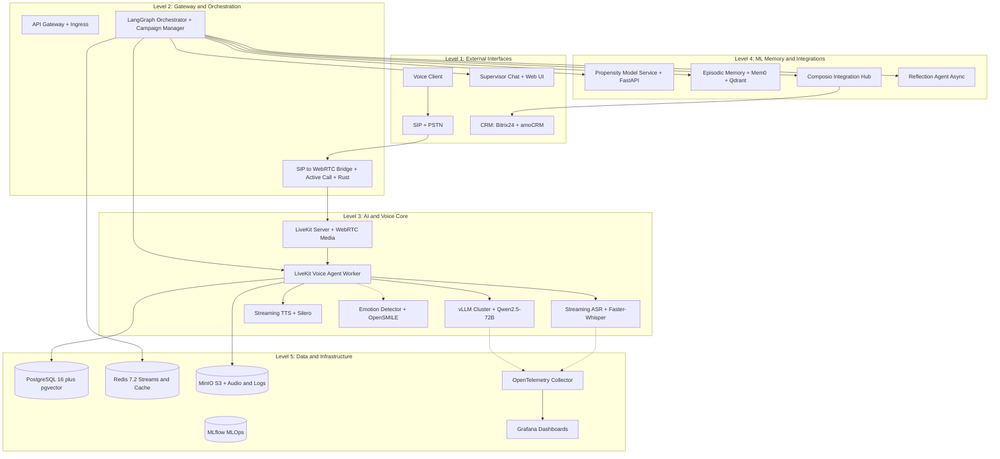
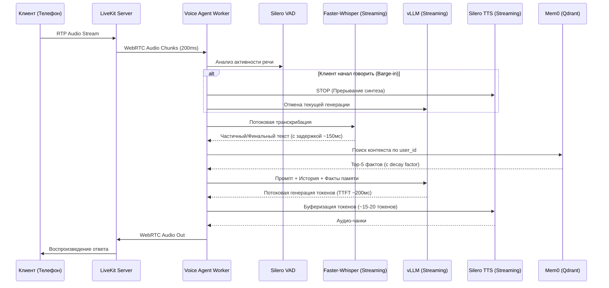
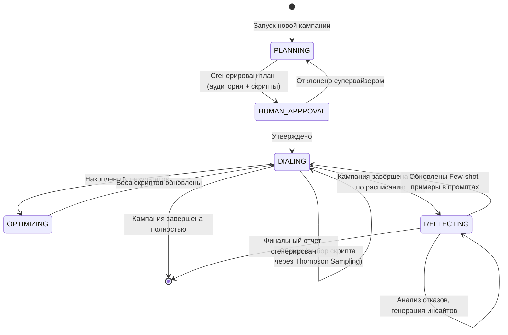
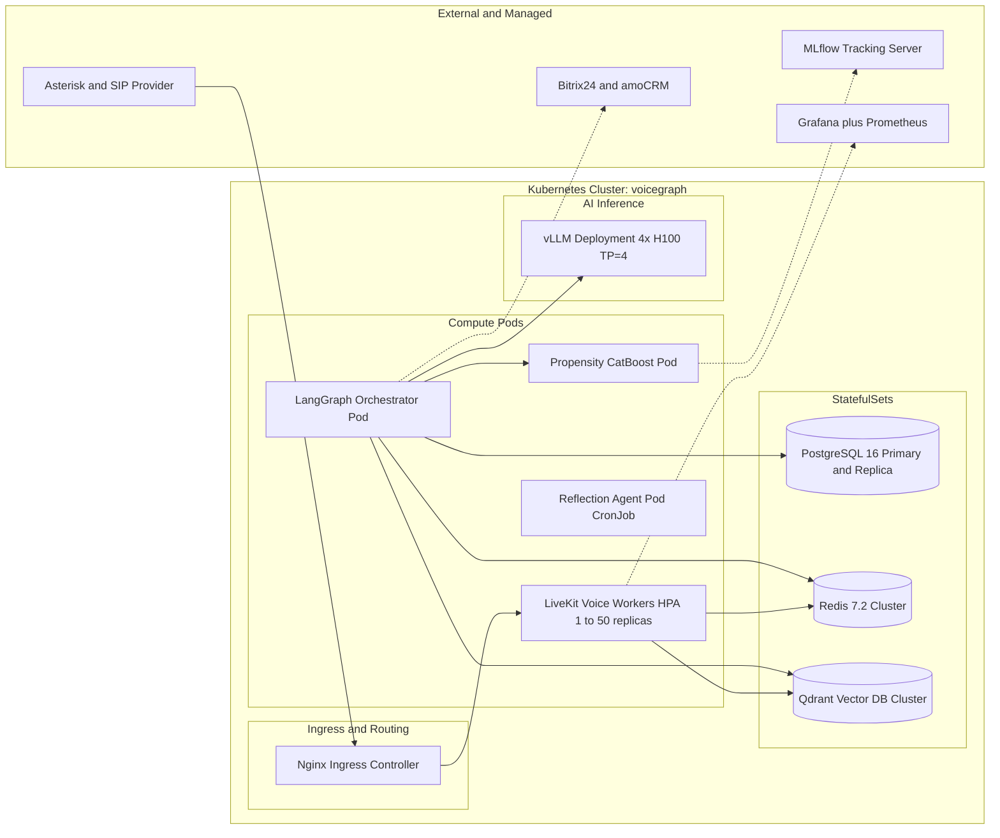

# Архитектура проекта: VoiceGraph: Autonomous Predictive Outbound Agent

## 1. Архитектурные принципы (Architectural Principles)
1. **Event-Driven & Streaming-First**: Все коммуникации между микросервисами асинхронны (Redis Streams). Голосовой пайплайн работает в режиме строгого стриминга (chunk-by-chunk) для обеспечения latency < 800 мс.
2. **Stateful Orchestration**: Сложная бизнес-логика кампаний управляется детерминированным конечным автоматом (LangGraph), а не хаотичными вызовами функций.
3. **Security & Compliance by Design**: PII-данные маскируются (Presidio) *до* попадания в LLM или логи. Все модели и векторные БД развернуты on-premise (контур РФ).
4. **Graceful Degradation**: При сбое внешнего API (CRM, Биллинг) система не падает, а использует Circuit Breaker, кэширует состояние и ставит задачу на ретрай или эскалацию человеку.
5. **Observability Native**: Каждый компонент инструментирован OpenTelemetry. Трейсинг звонка (Trace ID) сквозной: от SIP-INVITE до записи в CRM.

---

## 2. Высокоуровневая архитектура (High-Level System Architecture)

Система разделена на 5 логических слоев.

---

## 3. Детальный разбор ключевых подсистем

### 3.1. Real-time Voice Pipeline (Поток обработки голоса)
Это критический путь системы. Задержка должна быть минимальной, а обработка прерываний (barge-in) — мгновенной.

**Ключевые особенности:**
*   **Parallel Emotion Tracking**: Пока идет ASR, отдельный поток подает аудио в `OpenSMILE`. Если детектируется `ANGER`, в промпт LLM динамически добавляется инструкция: *"Клиент раздражен. Используй эмпатичный тон, извинись и предложи перевод на оператора"*.
*   **Prefix Caching**: vLLM кэширует системный промпт и историю диалога, что снижает Time-To-First-Token (TTFT) на 60-70%.

### 3.2. LangGraph Campaign Orchestrator (Управление кампанией)
Оркестратор управляет жизненным циклом кампании, а не отдельным звонком. Он использует конечный автомат с возможностью прерывания (Human-in-the-Loop).

**Детали узлов:**
*   **PLANNING**: Вызывает CatBoost API для скоринга базы, генерирует вариации скриптов через LLM.
*   **HUMAN_APPROVAL**: Использует `interrupt` в LangGraph. Отправляет JSON-план в Telegram-бот. Ждет `callback_query`.
*   **DIALING**: Потребляет задачи из `Redis Streams`. Для каждого звонка сэмплирует скрипт на основе Beta-распределения (Bandit).
*   **REFLECTING**: Асинхронный агент, который берет транскрипты с `outcome=REFUSAL`, анализирует их через LLM и обновляет глобальное состояние кампании.

### 3.3. ML Core & Episodic Memory
*   **Propensity Service**: Отдельный FastAPI-микросервис. Принимает батч `user_id`, извлекает фичи из PostgreSQL, прогоняет через CatBoost, возвращает отсортированный список. Инференс < 10 мс.
*   **Mem0 + Qdrant**: 
    *   При инициализации звонка: `mem0.search(query="предпочтения, жалобы, прошлые взаимодействия", user_id=X, limit=5)`.
    *   После звонка: `Reflection Agent` извлекает факты (`mem0.add(fact="Клиент просил не звонить после 18:00", user_id=X)`).
    *   **Memory Decay**: В payload Qdrant хранится `timestamp`. При поиске скор релевантности умножается на `exp(-lambda * days_since)`, чтобы старые факты не перебивали новые.

### 3.4. Security & Compliance Layer (152-ФЗ)
Реализован как обязательный Middleware на двух уровнях:
1. **Ingress Middleware (PII Sanitizer)**: Использует `Microsoft Presidio` с кастомными паттернами для РФ (СНИЛС, ИНН, паспорта). Заменяет сущности на `[REDACTED]` *до* того, как текст попадет в LLM или лог.
2. **Audit Logging**: Декоратор `@audit_log` оборачивает все вызовы инструментов (Composio, CRM). В PostgreSQL записывается: `timestamp`, `tool_name`, `masked_input`, `masked_output`, `llm_reasoning`. Логи неизменяемы (append-only).

---

## 4. Инфраструктура и DevOps (Deployment Architecture)

Система развертывается в Kubernetes-кластере (on-premise или в защищенном облаке РФ, например, Yandex Cloud / SberCloud) с использованием Helm-чартов.

**Ключевые конфигурации:**
*   **vLLM**: `tensor_parallel_size=4`, `enable_prefix_caching=true`, `gpu_memory_utilization=0.90`.
*   **LiveKit Workers**: Горизонтальное масштабирование (HPA) на основе кастомной метрики `active_webrtc_sessions`.
*   **Redis**: Включен `appendonly yes` (AOF) для сохранения состояний LangGraph при перезапуске подов.

---

## 5. Сквозной поток данных (End-to-End Data Flow)

Рассмотрим жизненный цикл **одного звонка** в рамках утвержденной архитектуры:

1. **Триггер**: `LangGraph (DIALING node)` извлекает задачу из `Redis Streams`. Задача содержит: `user_id=123`, `script_id=var_B`, `priority_score=0.85`.
2. **Инициализация**: `VoiceWorker` инициирует исходящий вызов через `SIP Bridge`.
3. **Поднятие трубки**: Клиент отвечает. `VoiceWorker` запрашивает у `Mem0` историю клиента (`user_id=123`). Получает: *"Жаловался на доставку 15.05.2026"*.
4. **Приветствие**: LLM генерирует персонализированный скрипт: *"Иван Иванович, здравствуйте. Это сервис контроля качества. Вижу, в прошлом месяце у вас была задержка доставки, сегодня все пришло вовремя?"*
5. **Диалог**: 
   * Клиент говорит. `VAD` детектирует речь.
   * `ASR` стримит текст.
   * `OpenSMILE` параллельно детектирует эмоцию `CALM`.
   * Текст (пройденный через `Presidio`) идет в `vLLM`.
   * `vLLM` генерирует ответ, `TTS` озвучивает.
6. **Завершение**: Клиент кладет трубку. `VoiceWorker` отправляет событие `CALL_ENDED` с `transcript`, `duration`, `outcome=SUCCESS` в `Redis Streams`.
7. **Пост-обработка**:
   * `LangGraph (OPTIMIZING node)` обновляет веса Thompson Sampling для `script_id=var_B` (alpha += 1).
   * `Composio` обновляет сделку в Битрикс24: ставит тег "NPS=9", добавляет краткое саммари.
   * Асинхронный `Reflection Agent` проверяет: если бы был отказ, он бы проанализировал транскрипт и предложил бы правку в скрипт.
8. **Аудит**: Все замаскированные действия записаны в PostgreSQL `agent_audit_logs`.

---

## 6. Резюме по технологическому стеку (Architecture Stack Summary)

| Слой | Технология | Обоснование выбора |
| :--- | :--- | :--- |
| **Orchestration** | `LangGraph` + `Redis` | Единственный фреймворк, нативно поддерживающий циклы, прерывания (HITL) и персистентность состояний. |
| **Voice Pipeline** | `LiveKit Agents` + `Silero VAD` | Low-latency WebRTC, нативная поддержка barge-in, асинхронная архитектура на Python. |
| **LLM Inference** | `vLLM` + `Qwen2.5-72B` | Максимальный throughput, prefix caching, полное соответствие 152-ФЗ (on-premise). |
| **ASR / TTS** | `Faster-Whisper` / `Silero` | Оптимизированы для CPU/GPU, низкая задержка, отличное качество для русского языка. |
| **Propensity ML** | `CatBoost` + `FastAPI` | State-of-the-art для табличных данных в РФ, встроенная обработка категориальных фич, <10мс инференс. |
| **Memory** | `Mem0` + `Qdrant` | Специализированная абстракция для эпизодической памяти с поддержкой decay и реляционных связей. |
| **Integrations** | `Composio` | Экономит месяцы разработки коннекторов к CRM, обеспечивает стандартизированные Tool-calling. |
| **Security** | `Microsoft Presidio` | Золотой стандарт on-premise PII-маскирования с поддержкой кастомных регулярок (СНИЛС, ИНН). |
| **Observability** | `OpenTelemetry` + `Prometheus` | Сквозной трейсинг (Trace ID) от SIP-пакета до записи в БД. |
